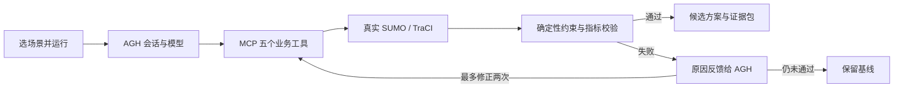

# Campus Signal Lab · 校园高峰路口信号配时优化智能体

本项目按原项目企划书实现：以 AGH 组织任务，通过 MCP 调用 Python 业务工具，以 SUMO / TraCI 计算车辆与行人指标，前端展示实际轨迹和方案比较。

所有交通需求都是**合成数据**。目前模型是一个四岔路口、四个直行车流和四个行人过街区域；尚未包含转向流、真实观测数据或真实灯控接入。配时上限等数值是项目假设，不作为道路交通标准。

- 详细实操手册：[智能体使用与实操手册](docs/智能体使用与实操手册.md)
- 项目原始企划：[项目企划书](校园高峰路口信号配时优化智能体-项目企划书.md)


## 打开项目

日常使用步骤见根目录 [使用说明.md](使用说明.md)。

双击根目录的 `start.cmd`。

- 业务仪表板：http://127.0.0.1:8765
- AGH 原生工作台：http://127.0.0.1:4177

首次使用，在 AGH 的 Provider 设置中选择 Agnes AI，核对账户提供的 Base URL，在密码输入框输入自己的 API key，测试连接、选择实际可用模型并保存。**密钥只填写在本地 AGH 设置里，不粘贴到聊天、源码或前端。**然后在仪表板选场景，点击“在 AGH 运行优化”。

现有仿真记录可以立即回放。页面会注明它是“本地验算工具记录”还是“MCP 工具回执”；本地验算记录不冒充 AGH 模型执行证据。

## 智能体怎么工作



1. `load_scenario`：读取场景、种子、约束。
2. `run_baseline`：生成固定的需求文件，运行固定配时，返回 `run_id`。
3. `search_timing_plan`：有限枚举周期和绿信比，先过滤非法候选。
4. `run_candidate`：批量真实仿真，同需求、同种子，从满足行人等待和进口等待条件的方案中选优。
5. `verify_and_compare`：从已保存结果校验绿灯、周期、碰撞、行人等待、进口最大等待、未完成需求和 5% 改善目标。失败时返回原因和基线。

AGH 模型负责调用顺序、解释和失败后的修正请求。Python 负责搜索和校验，SUMO 负责仿真指标。前端运行按钮通过官方 AGH Node SDK 发起独立会话。写入仿真结果的工具会触发 AGH 默认审批，看板仅提供“允许本次调用 / 拒绝本次调用”，不修改后台权限策略。

MCP 的注册 ID 是 `campus-signal`，显示名是 `campus-traffic-signal`。当前 AGH 为工具名添加哈希前缀；更长的服务 ID 会超过其扩展前缀校验限制，已通过缩短本项目 ID 兼容，无需修改 AGH 源码。

## 页面功能

- 六个合成场景：低流量、常态、课前高峰、单方向拥堵、行人高峰、零流量。
- 固定基线/候选轨迹切换，播放、拖动时间、2/5/10 倍速。
- 车辆平均延误、排队、行人等待、需求时段通过量。
- 展开工具回执查看输入和结果；查看校验失败原因。
- 查看真实 AGH 会话编号、模型、工具调用、审批决定、校验反馈及模型报告。
- 导出 ZIP：需求、配时、结果 JSON、SUMO 原始 XML、CSV、报告和工具回执；由 AGH 完成的任务还包含原生会话导出。

## 文件与本地环境

| 目录 | 内容 |
| --- | --- |
| `web/` | 业务仪表板，无外部 CDN |
| `traffic_agent/` | 搜索、校验、SUMO 适配、MCP、AGH 任务入口、HTTP 服务 |
| `config/` | 合成场景与项目约束 |
| `sumo/` | 源路网和生成的路网 |
| `scripts/` | 安装、编译、启动、AGH 操作与验算脚本 |
| `.tools/` | 本地 Node 24.10、Python 3.12、pnpm 10.34.5、AGH 源码、Microsoft 编译器与 SDK |
| `.cache/` | 安装包、校验清单、包缓存、临时文件 |
| `.runtime/` | AGH 配置、会话、日志、仿真原始记录、验算结果 |

没有全局安装新的 Node、Python、pnpm 或 Visual Studio。新增运行环境和依赖留在当前文件夹内。保留 `.runtime/agh` 可以保留 Provider 配置与会话；它可能包含凭据和会话数据，不应上传 GitHub。

## 命令

在项目根目录 PowerShell 中：

```powershell
# 启动两套本地页面
.tools/python/python.exe scripts/start-services.py

# 查看实际 AGH 会话
powershell -NoProfile -ExecutionPolicy Bypass -File scripts/agh.ps1 sessions --json

# 查看 MCP 状态和工具目录
powershell -NoProfile -ExecutionPolicy Bypass -File scripts/agh.ps1 mcp status campus-signal
powershell -NoProfile -ExecutionPolicy Bypass -File scripts/agh.ps1 mcp tools campus-signal

# 导出真实 AGH 会话（SESSION_ID 从 sessions --json 中获取）
powershell -NoProfile -ExecutionPolicy Bypass -File scripts/agh.ps1 export SESSION_ID --format agnes -o .runtime/agh-session.jsonl

# 重新计算一个高峰场景，结果标为本地验算
.tools/python/python.exe scripts/verify-project.py --quick

# 重新计算全部六个场景及边界条件
.tools/python/python.exe scripts/verify-project.py

# 检查实际 MCP stdio 连接
.tools/python/python.exe scripts/mcp-check.py
```

验算结果保存在 `.runtime/validation/summary.json`。原始运行数据在 `.runtime/reports/<run_id>/`，包括不可由前端编辑的输入、需求 SHA256、配时、SUMO `tripinfo.xml`、警告和轨迹。

SUMO 的配时由 TraCI 逐相位执行；直接双击 `.sumocfg` 不会复现这套控制逻辑，应使用上述 Python 工具入口。

## 指标口径与边界

- 车辆平均延误：SUMO `timeLoss + departDelay`，分母包含全部生成车辆需求；未插入需求也计入等待。
- 行人等待：SUMO 步行对象速度低于 0.1 m/s 的累计秒数。
- 最大排队：四个进口的停车车辆数的最大值。
- 通过量：需求时段前 600 秒内完成全段行程的车辆数。
- 600 秒之后继续清空，最长再运行 600 秒；未完成需求单独记录。
- 车辆绿灯固定互斥。行人独立放行，清空时间至少 14 秒；仍有行人在过街区域时延长全红。
- 固定随机种子只证明同需求下可重复，不证明效果可以推广到其他种子或真实道路。
- 有限搜索返回最佳已评估候选，不宣称全局最优。

## 依赖和出处

- [Agnes Harness 中文说明](https://github.com/AgnesAI-Labs/agnes-harness/blob/main/README.zh-CN.md)，原仓库 Apache-2.0，源码与 NOTICE 原样保留。
- [SUMO](https://sumo.dlr.de/docs/)，安装包附带其许可证。
- Python 业务依赖见 `requirements.txt`，本次实际版本见 `requirements.lock.txt`。
- Node 下载、Microsoft VS 清单及 payload 校验资料保存在 `.cache/`；编译器和 SDK 仅作本地构建使用。

交付状态和实际验算记录见 `docs/实施记录.md`。
